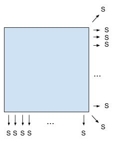

# Carré magique

Un carré magique de taille impaire N contient tous les entiers de [|1,N²|] et vérifie:

## 1. Que vaut `s`

`s` vaut `1+...+n² / n`

## 2. Créer une fonction `test_magique` pour vérifier que le carré est magique

## 3. Algorithme de création

Voir [construction](http://villemin.gerard.free.fr/Wwwgvmm/CarreMag/aaaMaths/Construc.htm).